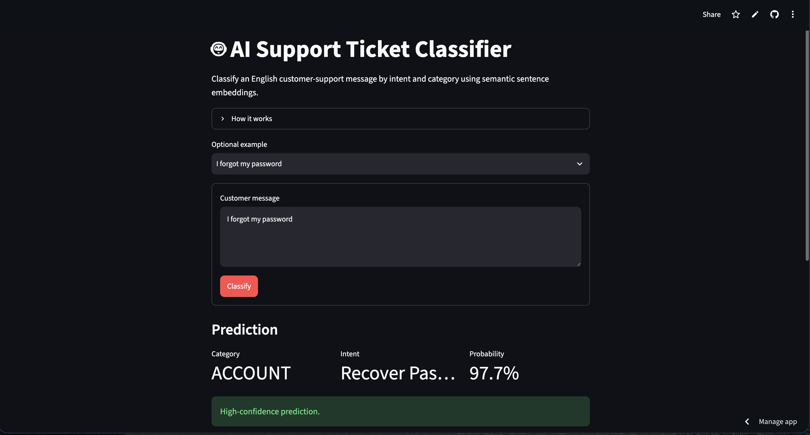
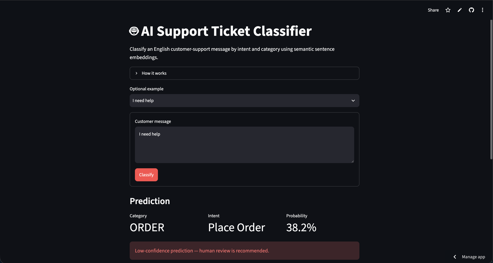

# AI Support Ticket Classifier

[](https://nlp-support-ticket-classifier-lecdv8vhvrqmsh762yxeud.streamlit.app/)

An end-to-end NLP project that classifies customer-support messages into **27 intents** and **11 business categories**. The project compares TF-IDF baselines with semantic sentence embeddings and deploys the selected model as an interactive Streamlit application.

## Try the app

**Live demo:** https://nlp-support-ticket-classifier-lecdv8vhvrqmsh762yxeud.streamlit.app/

Example input:

```text
I forgot my password
```

Example output:

```text
Category: ACCOUNT
Intent: recover_password
```

The application also displays the model's estimated probability, the top three predicted intents, and a human-review warning for low-confidence messages.

## Results

| Model | Test Accuracy | Test Macro F1 | 5-fold CV Macro F1 |
|---|---:|---:|---:|
| TF-IDF + Logistic Regression | 99.40% | 99.41% | 99.25% |
| TF-IDF + Linear SVM | **99.52%** | **99.52%** | **99.43%** |
| Calibrated Linear SVM | 99.48% | 99.48% | — |
| MiniLM embeddings + Logistic Regression | 99.40% | 99.40% | — |

The Linear SVM achieved the strongest held-out metrics. The final application uses **Sentence Transformers (`all-MiniLM-L6-v2`) + Logistic Regression** because manual out-of-dataset tests showed better behaviour on some paraphrased messages.

For example, for:

```text
My order has not arrived yet
```

the TF-IDF SVM predicted `create_account`, while the semantic model predicted `delivery_period`.

This manual robustness check is small and is **not** a substitute for a dedicated external test set; it is included to document the model-selection trade-off transparently.

## Application

### High-confidence prediction



### Low-confidence prediction



Confidence handling in the UI:

- **High:** probability >= 70%
- **Medium:** 40% to < 70%
- **Low:** < 40% — human review recommended

These thresholds are application rules, not guarantees of correctness.

## Dataset

The project uses the **Bitext Customer Support LLM Chatbot Training Dataset**:

- 26,872 rows
- 27 intent classes
- 11 broader categories
- English-language customer-support messages
- no missing values in the downloaded sample

Target:

```text
instruction -> intent
```

The dataset is not stored in this repository. Download it with:

```bash
python scripts/download_data.py
```

Source: https://huggingface.co/datasets/bitext/Bitext-customer-support-llm-chatbot-training-dataset

Dataset license: **CDLA-Sharing-1.0**.

## Modeling approach

### 1. TF-IDF baselines

Customer messages were vectorized with:

- lowercasing
- unigrams and bigrams
- `min_df=2`

Two classifiers were compared:

- Logistic Regression
- Linear SVM

### 2. Probability calibration

`LinearSVC` does not provide `predict_proba`, so `CalibratedClassifierCV` was tested to obtain calibrated probability estimates while preserving almost the same classification performance.

### 3. Semantic model

Messages were encoded with:

```text
sentence-transformers/all-MiniLM-L6-v2
```

Each message becomes a 384-dimensional embedding, which is then classified with Logistic Regression.

The deployed application uses this semantic model.

## Design Decisions and Trade-offs

The project compares lexical and semantic text-classification approaches instead of selecting a model only from the highest held-out accuracy.

**TF-IDF + Linear SVM achieved the strongest test metrics**, but TF-IDF relies heavily on the vocabulary and phrasing observed during training.

**Sentence embeddings were selected for the deployed application** because manual paraphrase tests showed better behavior on some differently worded support requests. This choice prioritizes semantic generalization over the small difference in benchmark accuracy.

**Logistic Regression is used on top of sentence embeddings** because it provides probability estimates and remains simple to inspect and deploy.

**Confidence thresholds are application rules.** High, medium and low confidence bands help communicate uncertainty but are not guarantees that a prediction is correct.

**The classifier is closed-set.** Every message is assigned to one of the known intents, so low-confidence outputs are surfaced for human review rather than treated as reliable automatic classifications.

## Automated Tests

The project includes automated tests covering:

- model artifact loading
- expected embedding dimensionality
- intent-label formatting
- top-k ranking behavior
- classifier probability output

Run:

pytest -q

GitHub Actions automatically runs the test suite on pushes and pull requests to main.

## Project structure

```text
nlp-support-ticket-classifier/
├── app/
│   └── app.py
├── data/
│   └── raw/
│       └── .gitkeep
├── images/
│   ├── app-high-confidence.png
│   └── app-low-confidence.png
├── models/
│   ├── intent_to_category.joblib
│   └── semantic_intent_classifier.joblib
├── notebooks/
│   └── exploration.ipynb
├── scripts/
│   └── download_data.py
├── .gitignore
├── LICENSE
├── README.md
└── requirements.txt
```

## Run locally

Clone the repository.

Create and activate a virtual environment.

Install dependencies:

```bash
pip install -r requirements.txt
```

Run the Streamlit application:

```bash
streamlit run app/app.py
```

To reproduce the notebook analysis, download the dataset first:

```bash
python scripts/download_data.py
```

Then open:

```text
notebooks/exploration.ipynb
```

Recommended Python version: **3.12**.

## Tech stack

Python · pandas · scikit-learn · Sentence Transformers · Hugging Face · Streamlit · joblib · Jupyter

## Limitations

- The training dataset is highly structured and balanced, so the very high test scores may overstate performance on genuinely messy production traffic.
- The deployed classifier is English-only.
- The confidence values are model probability estimates, not certainty.
- Manual paraphrase testing is useful for debugging but does not replace evaluation on an independent external dataset.
- Out-of-distribution messages can still receive a class prediction because this is a closed-set classifier.

## Future improvements

- Evaluate on an independent, manually curated external test set
- Fine-tune a transformer for intent classification
- Add explicit out-of-distribution detection
- Add multilingual support
- Add monitoring and feedback-driven retraining

## Licenses and attribution

Project code is released under the MIT License.

The Bitext dataset is distributed separately under **CDLA-Sharing-1.0**:
https://huggingface.co/datasets/bitext/Bitext-customer-support-llm-chatbot-training-dataset

The `sentence-transformers/all-MiniLM-L6-v2` model is licensed under **Apache-2.0**:
https://huggingface.co/sentence-transformers/all-MiniLM-L6-v2
